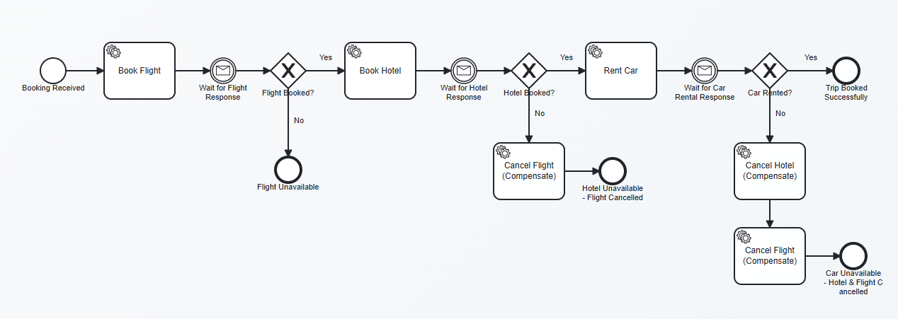

# OrqueIO Example - Travel Booking Saga

Orchestrated Saga pattern for travel booking using **OrqueIO** (BPMN engine) and **Apache Kafka** (async messaging).

## Architecture

```
                         ┌─────────────────────────┐
                         │     Travel Service       │
  POST /api/bookings ──► │   (OrqueIO Orchestrator) │
                         │    BPMN Saga Process     │
                         └────┬──────┬──────┬───────┘
                              │      │      │
                         Kafka Topics (async)
                              │      │      │
                    ┌─────────┘      │      └──────────┐
                    ▼                ▼                  ▼
             ┌────────────┐  ┌────────────┐  ┌─────────────────┐
             │   Flight   │  │   Hotel    │  │   Car Rental    │
             │   Service  │  │   Service  │  │    Service      │
             │  :8091     │  │  :8092     │  │   :8093         │
             └────────────┘  └────────────┘  └─────────────────┘
```

## Saga Flow (BPMN Process)



1. **Book Flight** → Send command to `saga.flight.command` → Wait for `FlightResponse`
   - *If failed*: End (no compensation needed)
2. **Book Hotel** → Send command to `saga.hotel.command` → Wait for `HotelResponse`
   - *If failed*: **Cancel Flight** (compensate) → End
3. **Rent Car** → Send command to `saga.car.command` → Wait for `CarRentalResponse`
   - *If failed*: **Cancel Hotel** → **Cancel Flight** (compensate in reverse order) → End
4. **Success**: All three bookings confirmed

## Kafka Topics

| Topic | Direction | Purpose |
|-------|-----------|---------|
| `saga.flight.command` | Travel → Flight | Book or cancel flight |
| `saga.flight.response` | Flight → Travel | Booking result |
| `saga.hotel.command` | Travel → Hotel | Book or cancel hotel |
| `saga.hotel.response` | Hotel → Travel | Booking result |
| `saga.car.command` | Travel → Car Rental | Rent or cancel car |
| `saga.car.response` | Car Rental → Travel | Rental result |

## Services

| Service | Port | Role |
|---------|------|------|
| Travel Service | 8090 | BPMN orchestrator (OrqueIO embedded) |
| Flight Service | 8091 | Flight booking (simulated seats per destination) |
| Hotel Service | 8092 | Hotel booking (rejects if budget < room rate) |
| Car Rental Service | 8093 | Car rental (simulated availability) |
| Kafka | 9092 | Message broker |
| Kafka UI | 9091 | Web UI for topic monitoring |

## Quick Start

### 1. Start Kafka

```bash
docker compose up -d
```

### 2. Build

```bash
mvn clean install -DskipTests
```

### 3. Start microservices (each in a separate terminal)

```bash
# Terminal 1 - Flight Service
cd flight-service && mvn spring-boot:run

# Terminal 2 - Hotel Service
cd hotel-service && mvn spring-boot:run

# Terminal 3 - Car Rental Service
cd car-rental-service && mvn spring-boot:run

# Terminal 4 - Travel Service (orchestrator - start last)
cd travel-service && mvn spring-boot:run
```

### 4. Create a booking

```bash
curl -X POST http://localhost:8090/api/bookings \
  -H "Content-Type: application/json" \
  -d '{
    "travelerName": "Alice Martin",
    "destination": "Tokyo",
    "departureDate": "2026-07-15",
    "returnDate": "2026-07-22",
    "passengers": 2,
    "budget": 3000
  }'
```

### 5. Check status

```bash
curl http://localhost:8090/api/bookings/{bookingId}/status
```

## Test Scenarios

### Happy Path (all succeed)
```bash
curl -X POST http://localhost:8090/api/bookings \
  -H "Content-Type: application/json" \
  -d '{"travelerName":"Bob","destination":"Paris","passengers":2,"budget":2000,"departureDate":"2026-08-01","returnDate":"2026-08-07"}'
```

### Hotel Failure (budget too low → flight compensated)
```bash
curl -X POST http://localhost:8090/api/bookings \
  -H "Content-Type: application/json" \
  -d '{"travelerName":"Charlie","destination":"Dubai","passengers":1,"budget":100,"departureDate":"2026-09-01","returnDate":"2026-09-05"}'
```
Dubai hotel rate is 450 EUR/night, budget of 100 EUR will be rejected → flight gets cancelled.

### Flight Failure (unknown destination → no compensation needed)
```bash
curl -X POST http://localhost:8090/api/bookings \
  -H "Content-Type: application/json" \
  -d '{"travelerName":"Diana","destination":"Mars","passengers":1,"budget":5000,"departureDate":"2026-10-01","returnDate":"2026-10-07"}'
```
No seats available for "Mars" → saga ends immediately.

## Key Design Patterns

- **Orchestration-based Saga**: OrqueIO (BPMN engine) coordinates the entire transaction
- **Asynchronous communication**: Kafka decouples services via message topics
- **Message correlation**: Kafka responses are correlated back to the waiting BPMN process instance
- **Compensation in reverse order**: On failure, previously completed steps are undone in reverse

## OrqueIO Cockpit

Access the process monitoring UI at: `http://localhost:8090/camunda/app/cockpit/default/`
- Username: `demo`
- Password: `demo`

## Technology Stack

- **OrqueIO** 1.0.7 (BPMN engine, fork of Camunda 7)
- **Spring Boot** 3.5.9
- **Apache Kafka** (Confluent 7.5.0)
- **Java** 21
- **H2** (in-memory database for process persistence)
